Java String Methods

This Small Project will help work on Strings with different operations

Output Images

1. str.length- Returns length of string

2. str.toUpperCase()- Converts string to uppper case

3. str.toLowerCase()- Converts string to lower case

4. str.slice(index_to_begin, index_to_end)- to extract a part of a string without changing the original.

5. str.substring(index_to_begin, index_to_end)- to extract a part of string.

6. str.substr(start,length)- to extract part of a string.

7. str.trim()- to remove whitespace from both the start and end of a string.

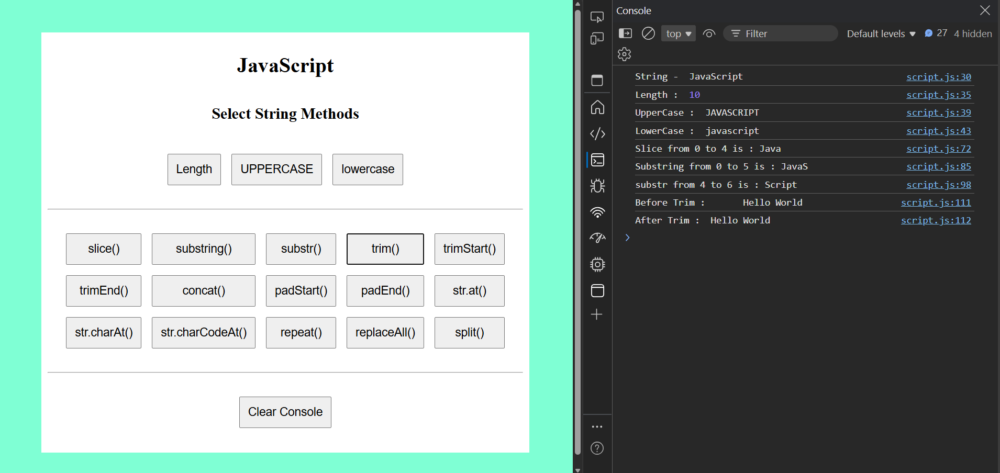

8. str.trimStart()- to remove whitespace from the start of a string.

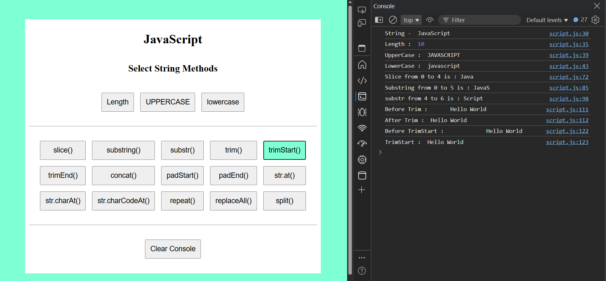

9. str.trimEnd()- to remove whitespace from the end of a string.

](output/trimEnd.png)

10. str1.concat(" ",str2)- Combine string str2 with str1

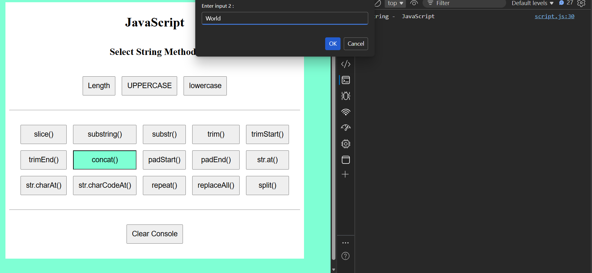
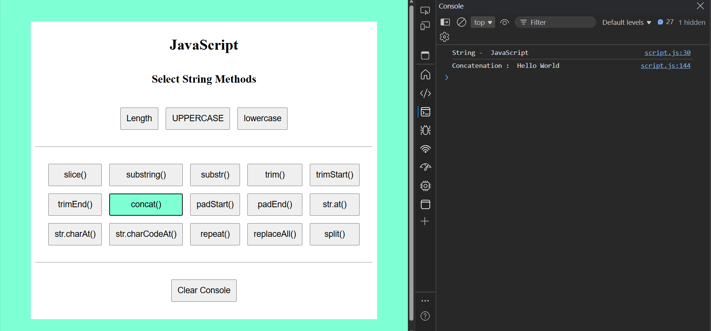

11. string.padStart(targetLength, padString)- to pad a string from the beginning (left side) until it reaches a given length.

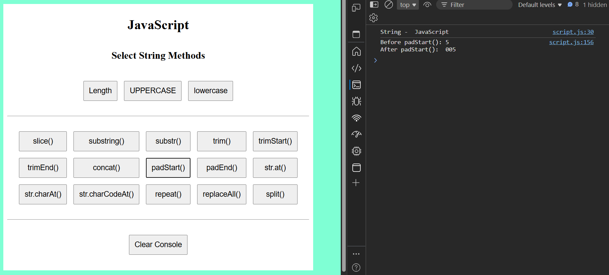

12. string.padEnd(targetLength, padString)- to pad a string from the end (left side) until it reaches a given length.

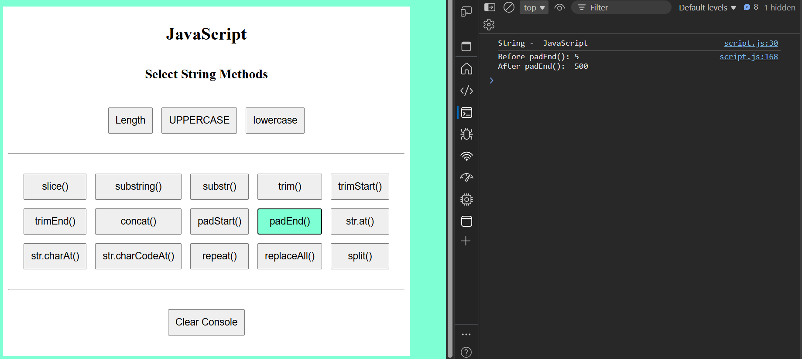

13. str.at(index)- to get a character at a specific index — with support for negative indexing.

14. str.charAt(index)- returns the character at a given index, but does not support negative indexing.

15. str.charCodeAt(index)- to get ASCII value of character at given index of string.

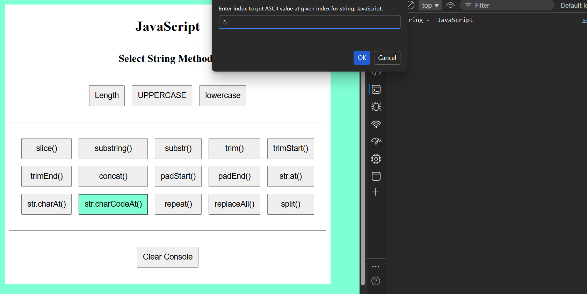

16. str.repeat(count)- to repeat a string a specified number of times.

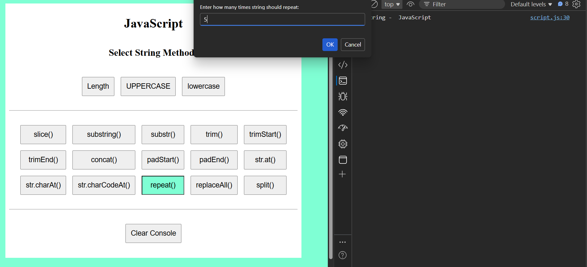

17. str.replaceAll(searchValue, replaceValue)- to replace all occurrences of a substring or pattern in a string.

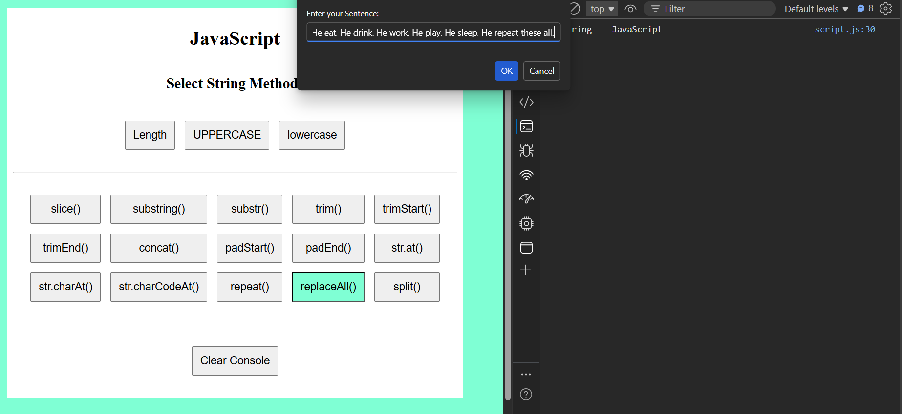
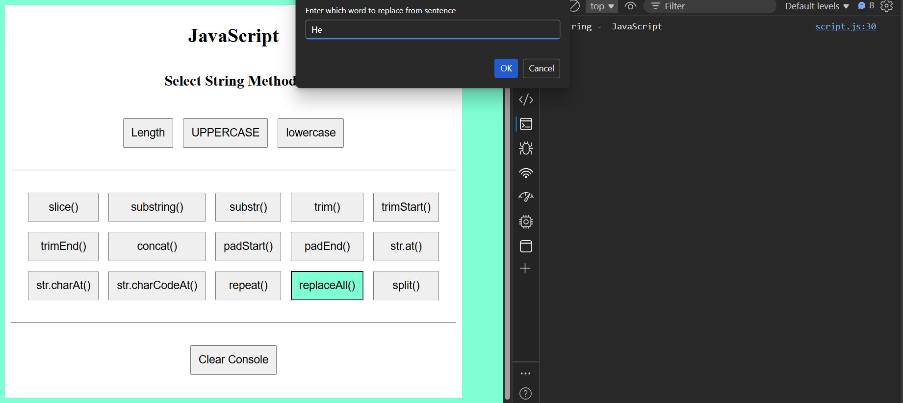

18. str.split(separator)- to split a string into an array of substrings based on a given separator.

eg str.split(" ");

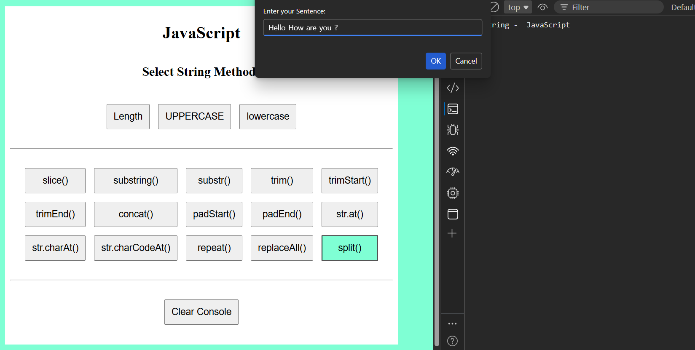

