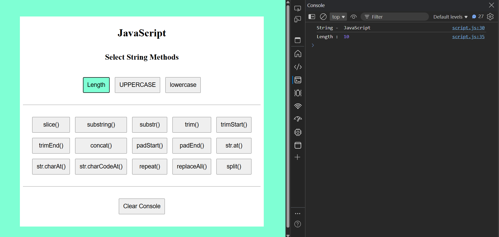
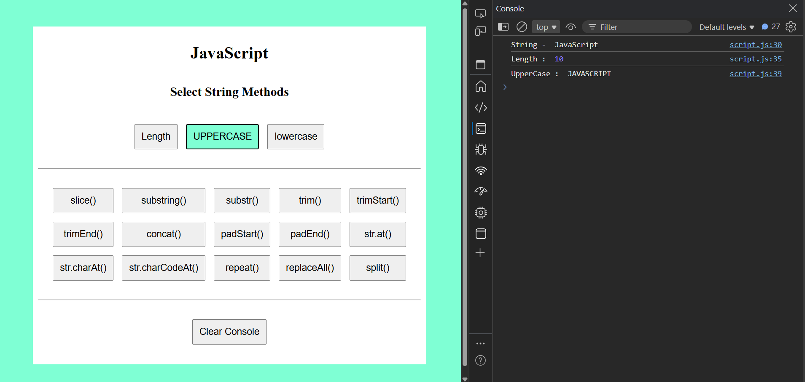
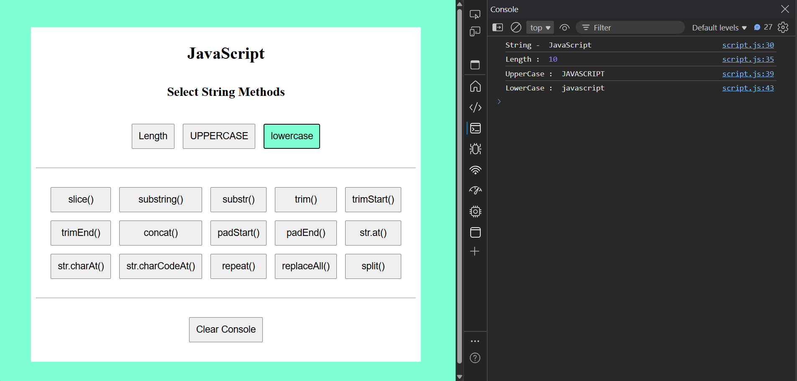

Java String Methods

This Small Project will help work on Strings with different operations

Output Images

1. str.length- Returns length of string

2. str.toUpperCase()- Converts string to uppper case

3. str.toLowerCase()- Converts string to lower case

4. str.slice(index_to_begin, index_to_end)- to extract a part of a string without changing the original.

5. str.substring(index_to_begin, index_to_end)- to extract a part of string.

